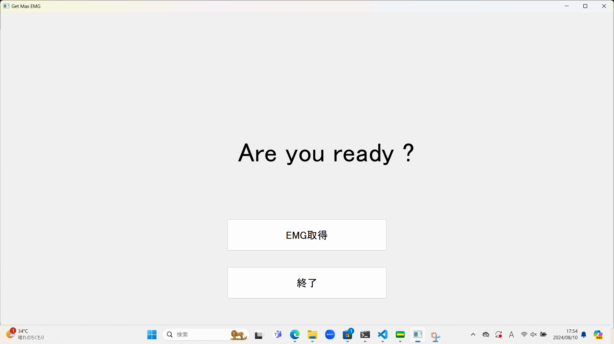
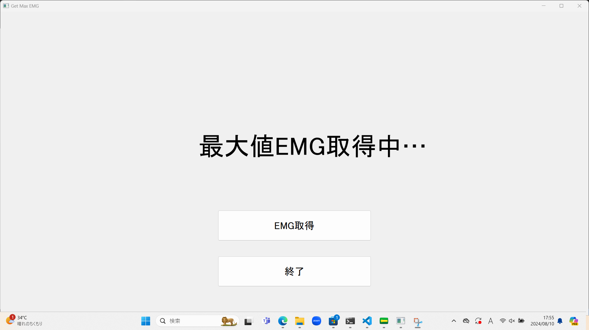
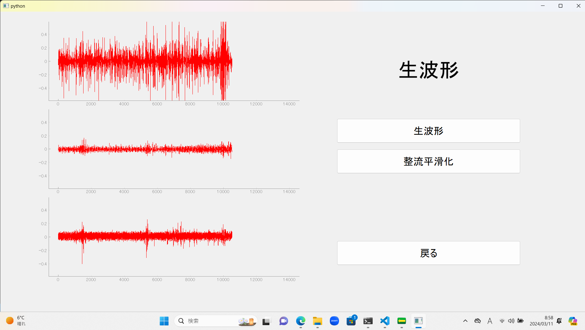

# sEiMG

筋電位信号計測プログラムです。
計測だけではなく、計測時に必要な機能を搭載しています。

## ディレクトリ構造

```
.
├── EMGsignal.py                         # 取得した筋電位信号の値を出力するプログラム
├── README.md                 
├── classification                       # 識別実験用のフォルダ
│   ├── classification_menu.py           # 学習モードor予測モードを選択する画面
│   ├── images                           # 学習時に表示する画像 
│   │   ├── motion1.png
│   │   ├── motion2.png
│   │   └── motion3.png
│   ├── learning_window.py               # 計測中の画面
│   ├── parameter                        # 学習した機械学習モデルのパラメータを保存するフォルダ
│   │   ├── mu.csv
│   │   └── sigma.csv
│   ├── prediction_window.py             # 識別結果の画面
│   └── probability_window.py            # 予測事後確率を表示するウィジェット
├── explain
│   ├── 設定.png
│   ├── デモ予測.png
│   ├── デモ学習.png
│   ├── メニュー.png
│   ├── 生波形画面.png
│   ├── 取得設定画面.png
│   └── レーダーチャート画面.png
├── get_max_emg.py                       # 最大EMGを取得する画面 
├── getemg_setting.py                    # 筋電位信号計測実験のデザインを選択する画面
├── images                               # 実験中に表示する動作の写真を格納
│   ├── motion1.png
│   ├── motion2.png
│   ├── motion3.png
│   ├── motion4.png
│   ├── motion5.png
│   └── motion6.png
├── intermittently_experiment_plot.py    # 1試行ずつ計測生波形プロットを表示する場合の画面
├── intermittently_experiment_reader.py  # 1試行ずる計測レーダチャートを表示する場合の画面
├── max_emg_data                         # 最大値EMGを保存する画面
│   ├── calibration_data.csv             # 最大値EMGを取得するために計測したデータ
│   └── max_data.csv                     # 最大値EMGを保存
├── menu.py                              # メニュー画面
├── menu_emgonlineplot.py                # 筋電位信号の波形を確認する画面
├── picture.py                           # 順番に指定した画像を表示するウィジェット
├── plot_emg.py                          # 筋電位信号の波形を表示するウィジェット
├── progress.py                          # 計測実験において，計測時間を表示するウィジェット
├── raderchart_mixup.py                  # ミックアップ対応のレーダーチャートを確認する画面 
├── reader_chart.py                      # レーダーチャートを表示するウィジェット
├── requirements.txt
├── sequential_experiment_plot.py        # 連続試行で計測生波形プロットを表示する場合の画面
├── sequential_experiment_reader.py      # 連続試行でレーダチャートを表示する場合の画面 
├── setting.ini                          # 実験条件の値が格納（設定画面で設定した値が保存）
├── setting.py                           # 設定画面
└── src                                  # 計測機器Delsysのプログラム
    ├── delsys.py                        # 生波形専用
    ├── delsys2.py                       # 正流平滑化専用
    └── pytrigno.py
```

## Getting started
計測する前に必要な処理の流れを説明する．

1. ターミナルから `menu.py` を実行
  - 以下のようなメニュー画面が表示される
  
2. メニュー画面から設定ボタンをクリック
  - 設定画面上で電極数，動作数，試行数 ‥ を指定．
  - 戻るボタンを押すと値が保存される  
  - （ `setting.ini` から変更しても可能 ）
  
3. 最大値EMG取得 **（レーダーチャートを表示させる場合は必須）**
  - レーダーチャートに表示させる EMG の値を正規化するため，ユーザから最大値を取得する
  - 以下計測準備画面
  
  - 以下EMG取得画面をクリックして被験者から最大値EMGを取得する
  


## リアルタイム生波形表示


## レーダーチャート画面


## 計測画面
